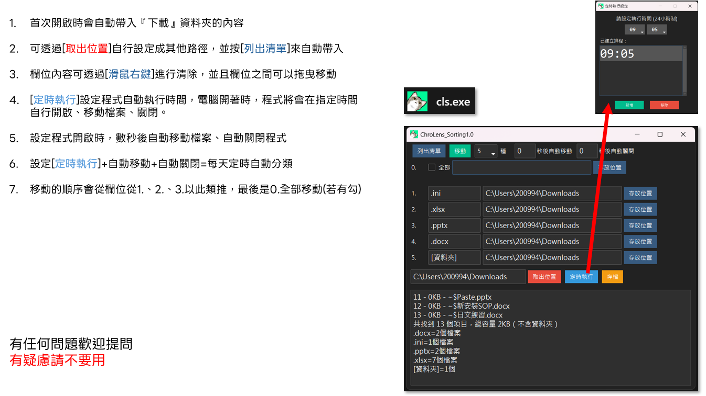

# 檔案自動分類工具 使用說明

## 基本操作

* **自動帶入路徑**: 首次開啟程式時，會自動設定「**取出位置**」為你的電腦「**下載**」資料夾。
* **手動設定路徑**: 
    1.  點擊「**取出位置**」，選擇你想要整理的資料夾。
    2.  點擊「**列出清單**」，程式會自動分析該資料夾內的檔案類型，並將常見的副檔名填入對應欄位。

---

## 欄位編輯與管理

* **清除欄位**: 在任何欄位上點擊**滑鼠右鍵**，即可快速清空該欄位的內容。
* **拖曳移動**: 
    1.  點擊並按住任何一個欄位。
    2.  將其拖曳到另一個欄位上，即可交換兩者的內容。

---

## 自動化功能

* **定時執行**:
    * 點擊「**定時執行**」按鈕，設定你希望程式自動執行的時間。
    * 只要電腦處於開機狀態，程式就會在指定時間自動啟動、移動檔案並關閉。
* **自動移動/自動關閉**:
    * 在主介面上方的「**秒後自動移動**」和「**秒後自動關閉**」欄位輸入秒數。
    * 程式啟動後，會先倒數計時，時間一到便會自動執行對應的操作。
* **完整自動化**: 結合「**定時執行**」與「**自動移動**」及「**自動關閉**」，即可實現每天定時自動整理檔案。

---

## 檔案移動順序

程式會依照你設定的規則，**從上到下**依序移動檔案：
1.  從編號 `1.` 開始，依序檢查和移動檔案。
2.  處理完所有已設定的編號欄位後，如果「**0.全部**」有勾選，才會將剩下的所有檔案移動到其指定的資料夾中。